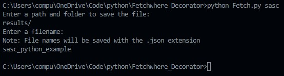
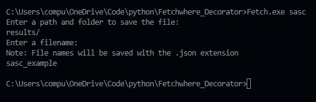
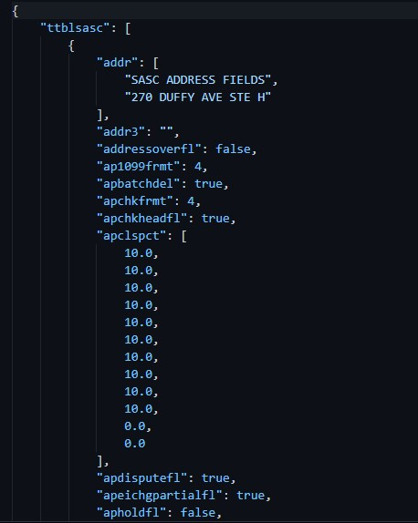

Running the code or the app is pretty straight forward.

## Commands

* Python: - python Fetch [payload]
* Command Line: - Fetch.exe [payload]

## Python:
Make sure you have [Python](https://www.python.org/downloads/) installed and it's in your PATH

From the terminal run: `python Fetch.py [payload]` 
Where: [payload] is the name of the fetchwhere request in the payloads folder:

__Example:__
`python Fetch.py sasc`

## Command Line:
From the command prompt or Terminal app run: `Fetch.exe [payload]`
Where: [payload] is the name of the fetchwhere request in the payloads folder:

__Example:__ `Fetch.exe sasc`

You will be prompted to enter a folder to save the response to as well as a file name.
You can save the response to any folder you like with any name you'd like.

__Note:__ It's not necessary to add the extension to the file name as it will be saved with the __.json__ extension automatically.
You can change this in the code by editing line 40:

`with open(folderinput+fileinput+".json", "w", encoding="utf-8") as jsonresponse:
    jsonresponse.write(prettyfetchWhereResponse)`

## Results

After running either of the above commands, you can view the resulting file by navigating to where you saved it.

__Example:__ 

